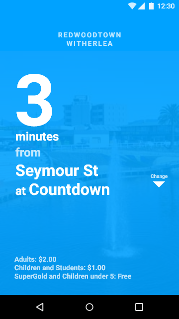

# blenheim-bus

Unofficial cross-platform app that shows the status of the Blenheim loop bus, displaying the next stop and how far it is away from that stop, as well as the route being travelled. The stop can be changed to be any that it visits to see how far it is away from there.

This app is designed to be ultra-simple and optimal for use by the elderly, with critical information (i.e. time and stop) in large font. It is initially assumed that route and fare information does not need to be as large as such an audience will be previously familiar with the bus system and thus know which stops they use most.

